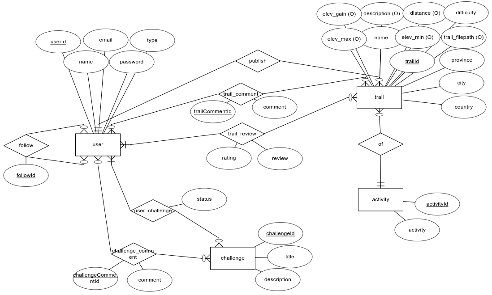

# Traily :mountain:

Traily is a **web application** where you can share your trails with other users. If you like to explore and enjoy nature, you are in the right place! You can visit us at [Traily](https://jluquer.github.io/traily). You can create your own account or can use the admin account:

- **Email**: admin@gmail.com
- **Password**: admin

## Table of contents

- [Overview :open_book:](#overview-open_book)
  - [Built with :hammer:](#built-with-hammer)
  - [Database :card_index_dividers:](#database-card_index_dividers)
- [Features :memo:](#features-memo)
- [How to use :thinking:](#how-to-use-thinking)
  
## Overview :open_book:

### Built with :hammer:

- [Angular :link:](https://angular.io/)
- [NodeJS :link:](https://nodejs.org)
- [TypeORM :link:](https://typeorm.io/#/)

### Database :card_index_dividers:

## Features :memo:

- Users can be a normal user or an admin.
- Users have to be logged in to:
  - Follow or unfollow other users.
  - Post and upload their tracks files.
  - Download other users track files.
  - Review, rate and comment trails or challenges.
  - Join/complete challenges.
- Admins have to be logged in to:
  - Create, delete, update and list activities.
  - Create, delete, update and list users.

## How to use :thinking:

Steps to run backend and frontend locally in development mode:

1. Run `npm i` command
2. Setup database settings inside `ormconfig.json` file
3. Run `npm run dev` command to run the backend
4. Open other terminal and run `npm run front` command to run the frontend
